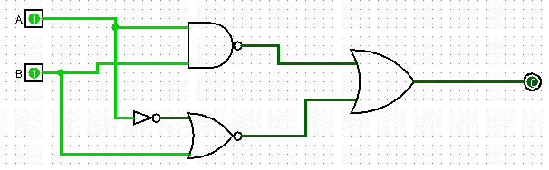

#+TITLE: Tarea 1.2: Álgebra de Boole, puertas lógicas y diseño de circuitos con Logisim
#+SUBTITLE: Sistemas Informáticos (1ºDAM)
#+AUTHOR: José Gaspar Sánchez García
#+email: jg.sanchezgarcia@edu.gva.es
#+date: \today

#+options: tasks:t tex:t timestamp:t title:t toc:t todo:t num:t |:t
#+LANGUAGE: es
#+STARTUP: overview

#+latex_class: article
#+latex_class_options:
#+latex_header:
#+latex_header_extra:
#+latex_class_pre:

#+LATEX_HEADER: \usepackage[utf8]{inputenc}
#+LATEX_HEADER: \usepackage{amsmath}
#+LATEX_HEADER: \usepackage{graphicx}
#+LATEX_HEADER: \usepackage{geometry}
#+LATEX_HEADER: \geometry{margin=2.5cm}

#+description: Álgebra de Boole, puertas lógicas, Logisim.
#+keywords: Álgebra de Boole, puertas lógicas, Logisim.
#+latex_footnote_command: \footnote{%s%s}
#+latex_engraved_theme:
#+latex_compiler: pdflatex

#+odt_styles_file: "./estilos.odt"

# SPDX-License-Identifier: CC BY-NC-SA 4.0
# Copyright (c) 2026 José Gaspar Sánchez García

* Datos de la actividad                                            :noexport:

| Campo                 | Descripción                                                               |
|-----------------------+---------------------------------------------------------------------------|
| Módulo                | Sistemas Informáticos                                                     |
| Ciclo formativo       | Desarrollo de Aplicaciones Multiplataforma (DAM)                          |
| Unidad de trabajo     | Representación de la información y fundamentos de lógica digital          |
| Título                | Álgebra de Boole, puertas lógicas y diseño de circuitos con Logisim       |
| Duración estimada     | 3–4 horas de trabajo práctico                                             |
| Modalidad             | Individual o por parejas, según indicación del profesorado                |
| Herramienta principal | Logisim o Logisim-evolution                                               |
| Entregables           | Archivo =.circ= de Logisim e informe técnico en PDF                       |
| Calificación          | 5 puntos / 10 puntos, según la ponderación establecida por el profesorado |

* Contexto y finalidad

Los sistemas informáticos trabajan internamente con información binaria. Las operaciones lógicas permiten representar, analizar y construir circuitos capaces de tomar decisiones a partir de señales de entrada.

En esta tarea diseñarás y simularás un circuito combinacional para controlar el acceso a un laboratorio de informática. Aplicarás álgebra de Boole, tablas de verdad, expresiones canónicas, simplificación lógica y síntesis de circuitos mediante puertas lógicas en Logisim.

* Objetivos de aprendizaje

Al finalizar la actividad, deberás ser capaz de:

- Construir la tabla de verdad de una función booleana de tres variables.
- Obtener expresiones booleanas a partir de un enunciado funcional.
- Expresar una función en forma normal disyuntiva (FND) y forma normal conjuntiva (FNC).
- Simplificar expresiones booleanas mediante leyes del álgebra de Boole.
- Verificar la simplificación mediante un mapa de Karnaugh de tres variables.
- Diseñar circuitos combinacionales utilizando puertas =AND=, =OR= y =NOT=.
- Implementar, etiquetar y simular circuitos digitales con Logisim.
- Comprobar la equivalencia funcional entre dos circuitos mediante simulación.
- Valorar el efecto de la simplificación sobre el número de componentes y la complejidad de un circuito digital.

* Ejercicios
** Ejercicio 1. Análisis de un circuito lógico

Analisis del siguiente circuito lógico para obtener:

#+DOWNLOADED: ~/images/20261002_Analisis.png @ 2026-10-02 05:12:28
#+caption: Análisis de un circuito lógico
#+name: Análisis circuito lógico
#+label: fig:Analisis_circuito_logico

- Ecuación de la función que represnta el circuito.
- Tabla de verdad.
- Implementación de la función simplificada
  
** Ejercicio 2. Síntesis de un circuito lógico
Diseña e implementa un cirucito lógico capaz de detectar números binarios de 4 bits que sean múltiplos de 3.
Debes obtener:
1. Tabla de verdad asociada al circuito.
2. Función lógica expresada como suma de productos.
3. Función lógica expresada como producto de sumas.
4. Expresiones mínimas de las funciones lógicas.
5. Simplificaciones a través de los mapas de Karnaugh.
6. Implementación del circuito con puertas básicas: AND, OR, NOT.
7. Implementación del ciruito sólo con pueras NAND.
8. Implementación del circuito sólo con puertas NOR.

** Ejercicio 3. Implementación de una tabla de verdad
A partir de la siguiente tabla de verdad:
#+caption: Tabla de verdad
#+name: tbl: Tabla_verdad
#+label:tbl: Tabla_verdad
| A | B | C | S_1 | S_2 |
|---+---+---+-----+-----|
| 0 | 0 | 0 |   1 |   1 |
| 0 | 0 | 1 |   0 |   0 |
| 0 | 1 | 0 |   1 |   1 |
| 0 | 1 | 1 |   1 |   0 |
| 1 | 0 | 0 |   0 |   1 |
| 1 | 0 | 1 |   0 |   0 |
| 1 | 1 | 0 |   1 |   1 |
| 1 | 1 | 1 |   0 |   0 |
|---+---+---+-----+-----|

Debes obtener:
1. Funciones lógicas de salida expresadas como suma de productos.
2. Funciones lógicas de salida  expresadas como producto de sumas.
4. Expresiones mínimas de las funciones lógicas.
5. Simplificaciones a través de los mapas de Karnaugh.
6. Implementación del circuito con puertas básicas: AND, OR, NOT.
7. Implementación del ciruito sólo con pueras NAND.
8. Implementación del circuito sólo con puertas NOR.

** Ejercicio 4. Implementación de expresiones lógicas
A partir de la siguiente expresión lógica:
\[
    F = \prod m(0,1,7,6,14,15) 
\]

Debes obtener:
1. Funciones lógicas de salida expresadas como suma de productos.
2. Funciones lógicas de salida  expresadas como producto de sumas.
4. Expresiones mínimas de las funciones lógicas.
5. Simplificaciones a través de los mapas de Karnaugh.
6. Implementación del circuito con puertas básicas: AND, OR, NOT.
7. Implementación del ciruito sólo con pueras NAND.
8. Implementación del circuito sólo con puertas NOR.

* Problema 1: Sistema de control de acceso

Un laboratorio de informática dispone de una cerradura eléctrica controlada por un circuito digital. El circuito debe decidir si permite la apertura de la puerta.

El sistema tiene tres entradas:

| Variable | Elemento                  | Valor 0                     | Valor 1                      |
|----------+---------------------------+-----------------------------+------------------------------|
| =A=      | Tarjeta de identificación | Tarjeta inválida            | Tarjeta válida               |
| =B=      | Sensor de presencia       | No hay persona en la puerta | Hay una persona en la puerta |
| =C=      | Modo seguro del profesor  | Modo seguro desactivado     | Modo seguro activado         |

La salida del sistema es:

| Variable | Elemento            | Valor 0        | Valor 1        |
|----------+---------------------+----------------+----------------|
| =Z=      | Cerradura eléctrica | Puerta cerrada | Puerta abierta |

**Condiciones de funcionamiento**

La puerta debe abrirse (=Z = 1=) cuando se cumpla alguna de estas situaciones:

1. La tarjeta es válida (=A = 1=) *y* se detecta una persona en la puerta (=B = 1=).
2. El modo seguro está activado (=C = 1=) *y* se detecta una persona en la puerta (=B = 1=).

La puerta no debe abrirse si no hay una persona en la puerta, aunque la tarjeta sea válida o el modo seguro esté activado.

** Parte 1: Análisis lógico
*** Actividad 1.1: Identificación de variables

Indica qué representa cada variable de entrada y de salida:

| Variable | Tipo    | Descripción |
|----------+---------+-------------|
| =A=      | Entrada |             |
| =B=      | Entrada |             |
| =C=      | Entrada |             |
| =Z=      | Salida  |             |

*** Actividad 1.2: Tabla de verdad

Construye la tabla de verdad completa de la función =Z(A,B,C)=.

Recuerda que una función con tres variables de entrada tiene:

\[
2^3 = 8
\]

combinaciones posibles.

Completa la siguiente tabla:

| Nº | A | B | C | Z |
|----+---+---+---+---|
|  0 | 0 | 0 | 0 |   |
|  1 | 0 | 0 | 1 |   |
|  2 | 0 | 1 | 0 |   |
|  3 | 0 | 1 | 1 |   |
|  4 | 1 | 0 | 0 |   |
|  5 | 1 | 0 | 1 |   |
|  6 | 1 | 1 | 0 |   |
|  7 | 1 | 1 | 1 |   |

*** Actividad 1.3: Expresión booleana inicial

A partir del enunciado, escribe una expresión booleana que represente el funcionamiento del sistema.

Usa la siguiente notación:

| Operación lógica | Símbolo              | Ejemplo |
|------------------+----------------------+---------|
| AND              | =·=                  | =A·B=   |
| OR               | =+=                  | =A+B=   |
| NOT              | ='= o barra superior | =A'=    |

Expresión inicial:

\[
Z =
\]

*** Actividad 1.4: Formas Canónicas

Obtén las siguientes expresiones a partir de la tabla de verdad:

1. Forma Normal Disyuntiva (FND), también denominada suma de minterms.
2. Forma Normal Conjuntiva (FNC), también denominada producto de maxterms.

Escribe las expresiones utilizando las variables =A=, =B= y =C=.

**** Suma de Productos (SdP)                                       :noexport:

\[
Z =
\]

**** Producto de Sumas (PdS)                                       :noexport:

\[
Z =
\]
** Parte 2: Simplificación de la función

*** Actividad 2.1: Simplificación mediante álgebra de Boole

Simplifica la expresión obtenida en la actividad anterior.

Debes mostrar los pasos intermedios y justificar las leyes empleadas. Puedes utilizar, entre otras, las siguientes leyes:

| Ley           | Expresión             |
|---------------+-----------------------|
| Identidad     | =A + 0 = A=           |
| Dominación    | =A + 1 = 1=           |
| Idempotencia  | =A + A = A=           |
| Complemento   | =A + A' = 1=          |
| Absorción     | =A + A·B = A=         |
| Distributiva  | =A·(B+C) = A·B + A·C= |
| Factorización | =A·B + A·C = A·(B+C)= |
| De Morgan     | =(A+B)' = A'·B'=      |
| De Morgan     | =(A·B)' = A' + B'=    |

Presenta el proceso:
**** Proceso simplificación                                        :noexport:
\[
\begin{aligned}
Z &= \\
  &= \\
  &= \\
\end{aligned}
\]

Resultado final simplificado:

\[
Z =
\]

*** Actividad 2.2: Verificación con mapa de Karnaugh

Construye un mapa de Karnaugh de tres variables y verifica que el resultado simplificado coincide con el obtenido mediante álgebra de Boole.

| A | BC=00 | BC=01 | BC=11 | BC=10 |
|---+-------+-------+-------+-------|
| 0 |       |       |       |       |
| 1 |       |       |       |       |

Indica:

- Las agrupaciones realizadas.
- Los /minterms/ incluidos en cada agrupación.
- La expresión simplificada obtenida.

** Parte 3: Síntesis en Logisim
*** Requisitos generales

Crea un archivo de Logisim llamado:

#+begin_example
control_acceso_apellido_nombre.circ
#+end_example

Sustituye =apellido_nombre= por tus datos.

El archivo deberá contener dos circuitos o subcircuitos:

1. =Circuito_original=
2. =Circuito_simplificado=

Utiliza nombres descriptivos para todos los componentes.

*** Actividad 3.1: Circuito original

Implementa en Logisim el circuito correspondiente a la expresión booleana inicial o a la forma FND obtenida.

Requisitos:

- Utiliza puertas =AND=, =OR= y =NOT=.
- Utiliza exclusivamente puertas =AND= y =OR= de dos entradas.
- Usa tres pines de entrada: =A=, =B= y =C=.
- Usa un pin de salida o LED etiquetado como =Z=.
- Etiqueta las conexiones internas cuando facilite la comprensión del circuito.
- Mantén un diseño ordenado, evitando cables innecesariamente largos o cruzados.

*** Actividad 3.2: Circuito simplificado

Implementa el circuito correspondiente a la función simplificada.

Requisitos:

- Crea un segundo circuito o subcircuito llamado =Circuito_simplificado=.
- Utiliza las mismas entradas: =A=, =B= y =C=.
- Añade una salida =Z=.
- Emplea el menor número de puertas posible, respetando la expresión simplificada.
- Compara visualmente el número de puertas y conexiones con el circuito original.

*** Actividad 3.3: Simulación y validación

Comprueba el comportamiento de ambos circuitos mediante simulación.

Para cada combinación de entradas:

1. Establece los valores de =A=, =B= y =C= con los interruptores o pines de  entrada.
2. Observa la salida =Z= en ambos circuitos.
3. Verifica que ambos circuitos generan el mismo resultado.
4. Contrasta los resultados con tu tabla de verdad.

Incluye en el informe capturas de, como mínimo, los siguientes casos:

| Caso                      | A | B | C | Resultado esperado de Z |
|---------------------------+---+---+---+-------------------------|
| No hay presencia          | 1 | 0 | 0 |                         |
| Acceso por tarjeta válida | 1 | 1 | 0 |                         |
| Acceso por modo seguro    | 0 | 1 | 1 |                         |
| Acceso denegado           | 0 | 1 | 0 |                         |
| Todos los valores activos | 1 | 1 | 1 |                         |

** Parte 4: Informe técnico

Entrega un informe en formato PDF con una portada donde aparezcan claramente los datos identificativos de la tarea y el alumno.

El informe debe contener los siguientes apartados:

*** 1. Identificación

- Nombre y apellidos.
- Grupo.
- Fecha de entrega.
- Título de la actividad.

*** 2. Análisis de la función

- Descripción de las variables =A=, =B=, =C= y =Z=.
- Tabla de verdad completa.
- Expresión booleana inicial.
- FND y FNC.

*** 3. Simplificación

- Proceso de simplificación algebraica.
- Leyes de Boole utilizadas.
- Mapa de Karnaugh.
- Expresión final simplificada.

*** 4. Implementación en Logisim

- Captura del circuito original.
- Captura del circuito simplificado.
- Comparación entre ambos diseños.
- Número de puertas empleadas en cada circuito.

*** 5. Validación

- Capturas de las simulaciones solicitadas.
- Tabla con los resultados obtenidos.
- Confirmación de que ambos circuitos son equivalentes.

*** 6. Reflexión final

Redacta entre 5 y 8 líneas respondiendo a estas cuestiones:

- ¿Qué ventajas aporta simplificar una función booleana antes de implementar un circuito?
- ¿Qué efecto puede tener la simplificación en el coste, consumo, mantenimiento y velocidad de un sistema digital?
- ¿Por qué es importante comprobar que el circuito simplificado mantiene el mismo comportamiento que el original?

** Ampliación voluntaria

Si has terminado la actividad, realiza una de las siguientes ampliaciones:

1. Implementa el circuito utilizando únicamente puertas =NAND=.
2. Implementa el circuito utilizando únicamente puertas =NOR=.
3. Añade una nueva entrada =D= que represente una alarma de emergencia. Si =D = 1=, la puerta deberá permanecer cerrada independientemente del valor de las demás entradas.
4. Implementa un indicador luminoso adicional =ALARMA= que se active cuando  haya presencia (=B = 1=), pero no se permita la apertura (=Z = 0=).
5. Diseña un subcircuito reutilizable denominado =ControlAcceso= con tres entradas (=A=, =B= y =C=) y una salida (=Z=).

** Criterios de evaluación                                         :noexport:

| Criterio              | Descripción                                                      | Puntuación |
|-----------------------+------------------------------------------------------------------+------------|
| Tabla de verdad       | Tabla completa y correcta para las ocho combinaciones de entrada |          1 |
| Expresiones canónicas | Obtención correcta de FND y FNC                                  |          1 |
| Simplificación        | Simplificación algebraica correcta y justificada                 |          1 |
| Circuito original     | Implementación funcional de la expresión inicial en Logisim      |          2 |
| Circuito simplificado | Implementación funcional, equivalente y optimizada               |          2 |
| Simulación            | Validación mediante casos de prueba y capturas                   |          1 |
| Informe técnico       | Presentación, organización, claridad y reflexión final           |          1 |
| Ampliación            | Ampliación voluntaria                                            |          1 |
|-----------------------+------------------------------------------------------------------+------------|
| *Total:*              |                                                                  |         10 |
#+TBLFM: @10$3=vsum(@2..@9)

* Entrega

Debes entregar los siguientes archivos en la actividad habilitada en Moodle:

| Archivo             | Nombre requerido                             |
|---------------------+----------------------------------------------|
| Circuito de Logisim | =control_acceso_apellido_nombre.circ=        |
| Informe técnico     | =informe_control_acceso_apellido_nombre.pdf= |

Antes de entregar, verifica que:

- El archivo =.circ= se abre correctamente en Logisim.
- Los dos circuitos están incluidos en el mismo archivo.
- Las entradas y salidas están etiquetadas.
- Los resultados de simulación coinciden con la tabla de verdad.
- El informe contiene todas las capturas solicitadas.
- Los archivos tienen el nombre requerido.

* Recursos
- Enlace de descaga Logisim: [[https://www.cburch.com/logisim/download.html][Download Logisim.]]
- Logisim-evolution: [[https://github.com/logisim-evolution/logisim-evolution][Proyecto Logisim-evolution]]
- Documentación y tutorial de Logisim: [[http://www.cburch.com/logisim/docs/][Documentación de Logisim]]
