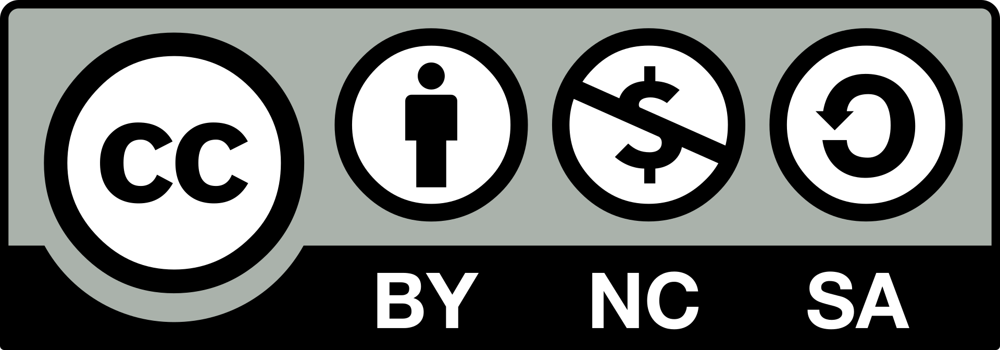

#+TITLE: Historia de la Informática
#+SUBTITLE: Sistemas informáticos
#+AUTHOR: José Gaspar Sánchez García.
#+email: jg.sanchezgarcia@edu.gva.es
#+DATE: {{{time(%d/%m/%Y)}}}

#+license: CC BY-NC-SA 4.0
#+KEYWORDS: Arquitectura Von Neumann, abaco, Ada, Babage

#+startup: beamer

#+LANGUAGE: es
#+OPTIONS: H:2 toc:nil num:t
#+BEAMER_THEME: Madrid
#+BEAMER_COLOR_THEME: whale
#+BEAMER_FONT_THEME: professionalfonts
#+BEAMER_HEADER: \usepackage[spanish]{babel}
#+BEAMER_HEADER: \usepackage{booktabs}
#+BEAMER_HEADER: \usepackage{tabularx}
#+BEAMER_HEADER: \usepackage{multicol}
#+BEAMER_HEADER: \usepackage{tikz}
#+BEAMER_HEADER: \usepackage{fontawesome5}

# SPDX-License-Identifier: CC BY-NC-SA 4.0
# Copyright (c) 2026 José Gaspar Sánchez García

* Licencia
** Licencia
Este documento se distribuye bajo la licencia
[[https://creativecommons.org/licenses/by-nc-sa/4.0/deed.es][Creative Commons 
Atribución 4.0 Internacional (CC BY-NC-SA 4.0)]].

#+DOWNLOADED: https://thumb.wikimedia.org/wikipedia/commons/thumb/1/12/Cc-by-nc-sa_icon.svg/1920px-Cc-by-nc-sa_icon.svg.png?utm_source=commons.wikimedia.org&utm_campaign=imageinfo&utm_content=thumbnail @ 2026-09-11 01:01:43

* Introducción

** ¿Qué entendemos por informática?

- La informática estudia el tratamiento automático de la información.
- Combina:
  - Datos.
  - Algoritmos.
  - Hardware.
  - Software.
  - Comunicaciones.
- La historia de la informática es la historia de una búsqueda:
  - Calcular más rápido.
  - Almacenar más información.
  - Automatizar tareas.
  - Comunicar resultados.

** Una evolución acelerada

#+BEGIN_EXPORT latex
\begin{center}
\begin{tikzpicture}[scale=0.85]
\node[draw, rounded corners, fill=blue!15, minimum width=2.4cm] at (0,0) {Cálculo};
\node[draw, rounded corners, fill=green!15, minimum width=2.4cm] at (3.2,0) {Automatización};
\node[draw, rounded corners, fill=orange!20, minimum width=2.4cm] at (6.4,0) {Computación};
\node[draw, rounded corners, fill=red!15, minimum width=2.4cm] at (9.6,0) {Conectividad};
\draw[->, thick] (1.3,0) -- (1.9,0);
\draw[->, thick] (4.5,0) -- (5.1,0);
\draw[->, thick] (7.7,0) -- (8.3,0);
\end{tikzpicture}
\end{center}
#+END_EXPORT

- No existe un único “primer ordenador”.
- La informática surge de muchas contribuciones sucesivas.
- Cada generación resuelve limitaciones de la anterior.

* Los primeros sistemas de cálculo

** El ábaco

- Uno de los primeros instrumentos para realizar cálculos.
- Sus orígenes se remontan, al menos, al segundo milenio antes de nuestra era.
- Utiliza posiciones discretas de fichas o cuentas.
- Permitía realizar:
  - Sumas.
  - Restas.
  - Multiplicaciones.
  - Divisiones.
- Idea fundamental:
  - La información puede representarse físicamente mediante estados diferenciados.

#+BEGIN_EXPORT latex
\begin{alertblock}{Idea clave}
El ábaco no automatiza completamente el cálculo, pero introduce una representación estructurada de los números.
\end{alertblock}
#+END_EXPORT

** El quipu andino

- Sistema de registro basado en cuerdas y nudos.
- Utilizado por pueblos andinos, especialmente por el Imperio inca.
- El color, la posición y el tipo de nudo aportaban información.
- Se utilizaba para registrar:
  - Censos.
  - Inventarios.
  - Tributos.
  - Recursos.
  - Organización administrativa.
- El sistema decimal aparece en numerosos quipus.

#+BEGIN_EXPORT latex
\begin{block}{Importancia informática}
El quipu demuestra que almacenar información no exige necesariamente utilizar escritura alfabética: los datos pueden codificarse mediante estructuras y reglas.
\end{block}
#+END_EXPORT

** De los instrumentos manuales a las máquinas

| Época | Instrumento | Aportación |
|-------+-------------+------------|
| Antigüedad | Ábaco | Representación física de cantidades |
| Andes prehispánicos | Quipu | Registro estructurado de información |
| Siglo XVII | Pascalina | Cálculo mecánico |
| Siglo XIX | Tarjetas perforadas | Automatización mediante instrucciones |
| Siglo XX | Computador electrónico | Cálculo programable de alta velocidad |

* Las calculadoras mecánicas

** La Pascalina

- Construida por Blaise Pascal alrededor de 1642.
- Diseñada para facilitar cálculos fiscales y administrativos.
- Utilizaba ruedas dentadas.
- Realizaba principalmente sumas y restas.
- Fue una de las primeras calculadoras mecánicas producidas de forma significativa.

** Leibniz y el cálculo mecánico

- Gottfried Wilhelm Leibniz desarrolló una calculadora mecánica más avanzada.
- La rueda de Leibniz permitía realizar:
  - Sumas.
  - Restas.
  - Multiplicaciones.
  - Divisiones.
- Su diseño influyó en calculadoras posteriores.

** El telar de Jacquard

- Joseph-Marie Jacquard desarrolló un telar controlado mediante tarjetas perforadas.
- Las tarjetas indicaban qué hilos debían levantarse.
- El patrón podía cambiarse sustituyendo las tarjetas.
- Aportación fundamental:
  - Separación entre la máquina y las instrucciones.
  - Primeros conceptos de programa y memoria externa.

#+BEGIN_EXPORT latex
\begin{alertblock}{Concepto esencial}
Una tarjeta perforada puede considerarse una secuencia de instrucciones codificadas físicamente.
\end{alertblock}
#+END_EXPORT

* Charles Babbage y Ada Lovelace

** La máquina diferencial

- Charles Babbage diseñó la máquina diferencial en el siglo XIX.
- Su objetivo era calcular automáticamente tablas matemáticas.
- Pretendía reducir los errores humanos.
- Utilizaba mecanismos de engranajes y diferencias finitas.
- No llegó a completarse plenamente durante su vida.

** La máquina analítica

- Babbage imaginó una máquina de propósito general.
- Sus componentes anticipaban la arquitectura de los computadores:
  - Unidad de cálculo.
  - Memoria.
  - Entrada.
  - Salida.
  - Control.
- Podía programarse mediante tarjetas perforadas.

** Ada Lovelace

- Ada Lovelace estudió las ideas de Babbage.
- Describió un método para calcular números de Bernoulli.
- Es considerada una de las primeras personas programadoras.
- Comprendió que una máquina podía manipular símbolos, no solo números.

#+BEGIN_EXPORT latex
\begin{block}{Visión adelantada}
Lovelace intuyó que una máquina programable podría trabajar con música, texto o imágenes si estos elementos se representaban simbólicamente.
\end{block}
#+END_EXPORT

* La mecanización de los datos

** Herman Hollerith

- Desarrolló un sistema de tarjetas perforadas para procesar información.
- Se utilizó para acelerar el censo de Estados Unidos de 1890.
- Cada perforación representaba una característica de una persona.
- Las máquinas podían:
  - Leer tarjetas.
  - Clasificarlas.
  - Contabilizar resultados.

** De Hollerith a IBM

- La empresa de Hollerith evolucionó hasta formar parte de IBM.
- Las tarjetas perforadas se convirtieron en un medio habitual para:
  - Almacenar datos.
  - Introducir programas.
  - Procesar información administrativa.
- Durante décadas fueron una interfaz fundamental de los computadores.

** Primera gran transición**

#+BEGIN_EXPORT latex
\begin{center}
\begin{tabular}{ccc}
\textbf{Cálculo manual} & $\longrightarrow$ & \textbf{Procesamiento mecánico}\\
Persona realiza las operaciones & & Máquina realiza operaciones repetitivas\\
\end{tabular}
\end{center}
#+END_EXPORT

* La era electromecánica

** El Harvard Mark I

- También conocido como IBM Automatic Sequence Controlled Calculator.
- Diseñado por Howard Aiken y construido con ayuda de IBM.
- Presentado en Harvard en 1944.
- Era electromecánico:
  - Relés.
  - Engranajes.
  - Interruptores.
  - Ejes motorizados.
- Podía ejecutar largas secuencias de operaciones automáticamente.

** Características del Mark I

- Aproximadamente 15 metros de longitud.
- Miles de componentes mecánicos.
- Funcionaba mediante instrucciones y datos en soportes perforados.
- Se utilizó para cálculos científicos y militares.
- Permaneció operativo hasta 1959.

#+BEGIN_EXPORT latex
\begin{alertblock}{Limitación}
El Mark I era programable, pero sus componentes mecánicos limitaban mucho su velocidad.
\end{alertblock}
#+END_EXPORT

** Mark I frente a ENIAC

| Característica          | Mark I             | ENIAC              |
|-------------------------+--------------------+--------------------|
| Tecnología              | Electromecánica    | Electrónica        |
| Componentes principales | Relés y engranajes | Válvulas de vacío  |
| Velocidad               | Baja               | Muy superior       |
| Programación            | Cinta y tarjetas   | Paneles y cableado |
| Aparición               | 1944               | 1945               |

* La primera generación: válvulas de vacío

** ¿Qué es una válvula de vacío?

- Dispositivo electrónico que controla el flujo de electrones.
- Puede actuar como:
  - Interruptor.
  - Amplificador.
  - Elemento lógico.
- Permitió sustituir mecanismos lentos por circuitos electrónicos.
- Fue la tecnología dominante en los primeros computadores electrónicos.

** Ventajas y problemas

| Ventajas                       | Problemas              |
|--------------------------------+------------------------|
| Mayor velocidad                | Gran consumo eléctrico |
| Funcionamiento electrónico     | Mucho calor            |
| Posibilidad de realizar lógica | Tamaño enorme          |
| Cálculo automático             | Fallos frecuentes      |
| Sin piezas mecánicas móviles   | Mantenimiento complejo |

** Programación en la primera generación

- Programar significaba modificar físicamente la máquina.
- Se utilizaban:
  - Cables.
  - Interruptores.
  - Paneles de control.
  - Tarjetas perforadas.
- No existían todavía los lenguajes de alto nivel modernos.
- Los programas estaban muy ligados al hardware.

* ENIAC

** El Electronic Numerical Integrator and Computer

- ENIAC significa *Electronic Numerical Integrator and Computer*.
- Se construyó entre 1943 y 1945 en la Universidad de Pensilvania.
- Sus principales responsables fueron:
  - John Presper Eckert.
  - John William Mauchly.
- Fue creado para calcular tablas balísticas para el ejército estadounidense.

** Características del ENIAC

- Primer computador electrónico de propósito general a gran escala.
- Utilizaba aproximadamente 17.000 válvulas de vacío.
- Ocupaba una sala de unos 167 metros cuadrados.
- Pesaba alrededor de 27 toneladas.
- Podía realizar miles de operaciones por segundo.
- El consumo eléctrico y la generación de calor eran enormes.

#+BEGIN_EXPORT latex
\begin{block}{Importancia histórica}
ENIAC demostró que un computador electrónico podía realizar cálculos a una velocidad muy superior a la de las máquinas electromecánicas.
\end{block}
#+END_EXPORT

** Programar el ENIAC

- La programación se realizaba conectando cables y configurando paneles.
- El cambio de programa podía requerir horas.
- Varias mujeres trabajaron como programadoras y operadoras del ENIAC.
- Entre ellas destacaron:
  - Jean Jennings Bartik.
  - Frances “Betty” Snyder Holberton.
  - Kathleen McNulty.
  - Marlyn Wescoff.
  - Ruth Teitelbaum.
  - Frances Bilas.

** El concepto de programa almacenado

- John von Neumann difundió una arquitectura basada en:
  - Memoria común para datos e instrucciones.
  - Unidad aritmético-lógica.
  - Unidad de control.
  - Entrada y salida.
- Esta idea simplificó la programación.
- La mayoría de los computadores actuales siguen basándose en este modelo, aunque con modificaciones.

* La Arquitectura de Von Neumann

** El Modelo de Von Neumann
- Propuesto en *1945* por el matemático *John von Neumann*.
- Introdujo el concepto clave de *programa almacenado*.
- **Hito histórico:** Datos e instrucciones se guardan juntos en la misma memoria física.
- Rompió con el modelo anterior de reprogramación manual por cableado.

** Arquitectura Completa del Sistema
Su principal innovación fue el concepto de programa almacenado, conectando la CPU con la memoria y los periféricos mediante buses compartidos.

#+ATTR_LATEX: :font \tiny
#+BEGIN_SRC text
+--------------------------------------------------------+

|                      C P U                             |
|  +--------------------+        +--------------------+  |
|  | Unidad de Control  | <----> | Unidad Aritmético- |  |
|  |       (UC)         |        |   Lógica (ALU)     |  |
|  +--------------------+        +--------------------+  |
|         ^      |                        ^              |
|         |      v                        v              |
|  +--------------------------------------------------+  |
|  |                  Registros                       |  |
|  +--------------------------------------------------+  |
+--------------------------------------------------------+
       ^            |                       ^

       | Bus de     | Bus de                | Bus de
       | Control    | Direcciones           | Datos
       v            v                       v
+-----------------------+        +-----------------------+

|   Memoria Principal   |        |  Sistema de Entrada/  |
|        (RAM)          |        |     Salida (E/S)      |
+-----------------------+        +-----------------------+
#+END_SRC

* Componentes Principales
** Bloques del Sistema
El hardware se divide en cuatro bloques funcionales interconectados:
1. **CPU** (Unidad Central de Procesamiento)
2. **Memoria Principal** (RAM)
3. **Sistema de Entrada/Salida** (E/S)
4. **Buses** (Canales de comunicación)

** La CPU: El Cerebro del Sistema
- **Unidad de Control (UC):** Coordina los componentes y dirige el flujo de datos.
- **Unidad Aritmético-Lógica (ALU):** Realiza operaciones matemáticas y lógicas.
- **Registros:** Memorias internas de alta velocidad:
  - *PC (Contador de Programa):* Dirección de la siguiente instrucción.
  - *IR (Registro de Instrucción):* Instrucción en ejecución actual.
  - *AC (Acumulador):* Resultados temporales de la ALU.

** Memoria, E/S y Buses
- **Memoria Principal (RAM):**
  - Espacio de almacenamiento unificado y volátil.
  - No distingue físicamente entre datos e instrucciones.
- **Sistema de Entrada/Salida (E/S):**
  - Interfaz con el mundo exterior (periféricos).
- **Los Buses (Autopistas de datos):**
  - *Bus de Datos:* Transporta información (bidireccional).
  - *Bus de Direcciones:* Indica la posición de memoria (unidireccional).
  - *Bus de Control:* Señales de sincronización y reloj.

* El Ciclo de Instrucción
** El Ciclo de Von Neumann (Fases 1 y 2)
Para ejecutar un programa, la CPU repite continuamente un ciclo de cuatro pasos:

#+ATTR_BEAMER: :environment block
#+BEGIN_BLOCK: 1. Captura (Fetch)
La UC lee la instrucción de la memoria principal apuntada por el Contador de Programa (PC) y la vuelca en el Registro de Instrucción (IR).
#+END_BLOCK

#+ATTR_BEAMER: :environment block
#+BEGIN_BLOCK: 2. Decodificación
La UC interpreta el código de operación de la instrucción almacenada en el IR para determinar qué acción realizar y qué operandos necesita.
#+END_BLOCK

** El Ciclo de Von Neumann (Fases 3 y 4)

#+ATTR_BEAMER: :environment block
#+BEGIN_BLOCK: 3. Ejecución
La ALU realiza la operación aritmética o lógica solicitada, u ordena el movimiento de datos hacia o desde los periféricos.
#+END_BLOCK

#+ATTR_BEAMER: :environment block
#+BEGIN_BLOCK: 4. Almacenamiento e Incremento (Writeback)
El resultado obtenido se escribe en el registro destino (como el Acumulador) o en la memoria principal. Simultáneamente, el Contador de Programa (PC) se incrementa para apuntar a la dirección de la próxima instrucción.
#+END_BLOCK

* Limitaciones y Soluciones
** El Cuello de Botella de Von Neumann
- **El Problema:** Al compartir el mismo bus para datos e instrucciones, la CPU no puede leer ambos a la vez.
- **Consecuencia:** La CPU debe esperar a la memoria, limitando la velocidad global del sistema.

*** Soluciones actuales :B_block:
:PROPERTIES:
:BEAMER_env: block
:END:
- **Memoria Caché:** Memorias ultra-rápidas intermedias integradas en la CPU.
- **Segmentación (Pipelining):** Ejecución simultánea de fases de distintas instrucciones.

** Alternativa: Arquitectura Harvard
- Utiliza **dos memorias físicas independientes**:
  - Una memoria exclusiva para instrucciones.
  - Una memoria exclusiva para datos.
- Permite el acceso simultáneo a ambos elementos eliminando el cuello de botella.
- **Uso actual:** Muy común en microcontroladores (Arduino/Sistemas empotrados) y cachés internas de CPU modernos.

* Generaciones de computadores

** Primera generación: válvulas

- Periodo aproximado: década de 1940 y comienzos de 1950.
- Tecnología:
  - Válvulas de vacío.
- Programación:
  - Lenguaje máquina.
  - Cableado.
  - Tarjetas perforadas.
- Características:
  - Gran tamaño.
  - Alto consumo.
  - Poca fiabilidad.
  - Elevado coste.

** Segunda generación: transistores

- Periodo aproximado: década de 1950 y comienzos de 1960.
- El transistor sustituyó a la válvula de vacío.
- Ventajas:
  - Menor tamaño.
  - Menor consumo.
  - Menor generación de calor.
  - Mayor fiabilidad.
- Aparecen lenguajes como:
  - FORTRAN.
  - COBOL.
  - ALGOL.

** Tercera generación: circuitos integrados

- Periodo aproximado: década de 1960.
- Varios transistores se integran en un único chip.
- Aumentan:
  - La velocidad.
  - La fiabilidad.
  - La capacidad de almacenamiento.
- Se popularizan los sistemas operativos.
- Aparecen familias compatibles de computadores.

** Cuarta generación: microprocesadores

- Desde la década de 1970.
- La unidad central de procesamiento se integra en un chip.
- El computador deja de ocupar una sala.
- Se inicia la expansión de:
  - Calculadoras programables.
  - Ordenadores personales.
  - Consolas.
  - Sistemas embebidos.

** Quinta generación y etapa actual

- No existe una definición única.
- Se asocia con:
  - Inteligencia artificial.
  - Procesamiento paralelo.
  - Computación distribuida.
  - Interfaces naturales.
  - Computación móvil.
  - Computación en la nube.
  - Computación cuántica.

* El transistor y el circuito integrado

** El transistor

- Inventado en Bell Labs en 1947.
- Sustituyó a las válvulas en muchas aplicaciones.
- Puede funcionar como interruptor electrónico.
- Es uno de los componentes básicos de los circuitos digitales.
- La reducción de tamaño de los transistores permitió aumentar la capacidad de los chips.

** El circuito integrado

- Integra muchos componentes electrónicos en una pequeña pastilla de silicio.
- Reduce:
  - Espacio.
  - Coste.
  - Consumo.
  - Número de conexiones.
- Permite construir sistemas cada vez más complejos.

** Ley de Moore

- Gordon Moore observó que el número de transistores por circuito integrado crecía rápidamente.
- Durante décadas, esta tendencia impulsó:
  - Más rendimiento.
  - Más memoria.
  - Menor coste por operación.
  - Dispositivos más pequeños.

#+BEGIN_EXPORT latex
\begin{alertblock}{Idea clave}
La evolución no consiste únicamente en fabricar máquinas más rápidas: también implica hacerlas más pequeñas, económicas, eficientes y accesibles.
\end{alertblock}
#+END_EXPORT

* El microprocesador

** El Intel 4004

- Presentado en 1971.
- Considerado uno de los primeros microprocesadores comerciales.
- Era un procesador de 4 bits.
- Contenía aproximadamente 2.300 transistores.
- Fue diseñado inicialmente para calculadoras.

** Del microprocesador al ordenador

- El microprocesador integra la CPU en un solo circuito.
- Facilita la creación de:
  - Ordenadores personales.
  - Sistemas de control.
  - Instrumentos científicos.
  - Dispositivos domésticos.
- La informática pasa de los centros de cálculo a empresas, centros educativos y hogares.

* Los ordenadores personales

** Los primeros microordenadores

- A finales de la década de 1970 aparecen equipos dirigidos a aficionados.
- Ejemplos:
  - Altair 8800.
  - Apple II.
  - Commodore PET.
  - TRS-80.
- Utilizaban microprocesadores y memoria cada vez más asequible.
- Se programaban frecuentemente en BASIC.

** El IBM PC 5150

- IBM presentó su ordenador personal en agosto de 1981.
- Incorporaba:
  - Procesador Intel 8088.
  - Sistema operativo MS-DOS.
  - Teclado.
  - Monitor.
  - Unidades de disquete.
- Su arquitectura abierta favoreció la aparición de equipos compatibles.
- Se convirtió en un estándar de facto en el mundo empresarial.

#+BEGIN_EXPORT latex
\begin{block}{Consecuencia}
El PC transformó el ordenador en una herramienta de trabajo habitual para empresas, administraciones y usuarios particulares.
\end{block}
#+END_EXPORT

** El ordenador personal como plataforma

- El hardware deja de ser suficiente por sí solo.
- Crece la importancia de:
  - Sistemas operativos.
  - Aplicaciones ofimáticas.
  - Bases de datos.
  - Lenguajes de programación.
  - Redes locales.
  - Dispositivos periféricos.
- La informática se convierte en un ecosistema de hardware y software.

* De los PC a Internet

** Las redes de computadores

- Las redes permiten conectar ordenadores.
- Objetivos principales:
  - Compartir recursos.
  - Intercambiar datos.
  - Ofrecer servicios.
  - Trabajar de forma colaborativa.
- Evolución:
  - Redes militares y académicas.
  - Redes locales.
  - Internet.
  - Web.
  - Servicios en la nube.

** La World Wide Web

- La Web facilitó el acceso a documentos enlazados.
- Se apoyó en:
  - HTML.
  - HTTP.
  - URL.
  - Navegadores.
  - Servidores web.
- Transformó Internet en una plataforma de información y servicios.

** La informática ubicua

- Actualmente encontramos computadores en:
  - Teléfonos móviles.
  - Vehículos.
  - Electrodomésticos.
  - Relojes.
  - Sistemas industriales.
  - Hospitales.
  - Centros educativos.
  - Satélites.
- Muchas veces no identificamos estos sistemas como “ordenadores”, aunque lo sean.

* Los computadores actuales

** Características generales

- Procesadores multinúcleo.
- Grandes cantidades de memoria.
- Almacenamiento SSD.
- Procesadores gráficos especializados.
- Redes de alta velocidad.
- Virtualización y contenedores.
- Servicios distribuidos.
- Sistemas operativos móviles y de escritorio.

** Computación en la nube

- Los recursos informáticos se ofrecen como servicios.
- El usuario puede utilizar:
  - Procesamiento.
  - Almacenamiento.
  - Bases de datos.
  - Redes.
  - Aplicaciones.
- El modelo desplaza parte de la infraestructura desde el equipo local hacia centros de datos.

** Centros de datos

- Agrupan miles de servidores.
- Requieren:
  - Alimentación eléctrica.
  - Refrigeración.
  - Redes redundantes.
  - Seguridad física.
  - Copias de seguridad.
  - Monitorización.
- Son la infraestructura de servicios como:
  - Correo electrónico.
  - Streaming.
  - Redes sociales.
  - Inteligencia artificial.
  - Aplicaciones web.

* Supercomputadores

** ¿Qué es un supercomputador?

- Sistema diseñado para ejecutar cálculos extremadamente complejos.
- Está compuesto por muchos nodos de procesamiento.
- Utiliza:
  - Paralelismo.
  - Redes de baja latencia.
  - Grandes sistemas de almacenamiento.
  - Aceleradores gráficos o especializados.
- Se emplea en:
  - Meteorología.
  - Investigación médica.
  - Simulación física.
  - Energía.
  - Astronomía.
  - Inteligencia artificial.
  - Seguridad y criptografía.

** FLOPS y rendimiento

- FLOPS significa operaciones de coma flotante por segundo.
- Unidades habituales:
  - GFLOPS: \(10^9\) operaciones por segundo.
  - TFLOPS: \(10^{12}\).
  - PFLOPS: \(10^{15}\).
  - EFLOPS: \(10^{18}\).
- El rendimiento real depende también de:
  - Memoria.
  - Comunicación entre nodos.
  - Algoritmos.
  - Consumo energético.
  - Tipo de aplicación.

** La era exascala

- Un sistema exascala supera \(10^{18}\) operaciones de coma flotante por segundo.
- Los supercomputadores exascala combinan millones de núcleos.
- Requieren una gestión energética y térmica muy avanzada.
- En la lista TOP500 de junio de 2026 aparece LineShine como sistema líder, con aproximadamente 2,198 exaFLOPS en HPL.
- El ranking debe interpretarse según el benchmark y la fecha de medición. [3][6]

** Ejemplos de supercomputadores

| Sistema     | País           | Uso o característica                               |
|-------------+----------------+----------------------------------------------------|
| LineShine   | China          | Primer puesto del TOP500 de junio de 2026          |
| El Capitan  | Estados Unidos | Simulación científica y seguridad nacional         |
| Frontier    | Estados Unidos | Investigación científica e inteligencia artificial |
| Aurora      | Estados Unidos | Ciencia, simulación e IA                           |
| MareNostrum | España         | Investigación científica y técnica                 |

#+BEGIN_EXPORT latex
\begin{alertblock}{Importante}
El supercomputador más rápido no es necesariamente el mejor para todas las tareas. El rendimiento depende del problema que se quiera resolver.
\end{alertblock}
#+END_EXPORT

* Del cálculo a la inteligencia artificial

** Procesamiento especializado

- La CPU es adecuada para tareas generales.
- La GPU permite ejecutar muchas operaciones en paralelo.
- Los aceleradores de IA optimizan:
  - Matrices.
  - Redes neuronales.
  - Aprendizaje profundo.
- Los sistemas actuales combinan distintos tipos de procesadores.

** Inteligencia artificial

- La IA utiliza algoritmos y datos para realizar tareas complejas.
- Aplicaciones:
  - Reconocimiento de imágenes.
  - Procesamiento del lenguaje.
  - Recomendación de contenidos.
  - Diagnóstico asistido.
  - Generación de texto, imagen y código.
- El desarrollo actual depende de:
  - Grandes volúmenes de datos.
  - Procesadores paralelos.
  - Redes de alta velocidad.
  - Centros de datos.

** Computación cuántica

- Utiliza principios de la física cuántica.
- En lugar de bits convencionales utiliza qubits.
- Puede ofrecer ventajas en problemas concretos.
- Todavía presenta retos importantes:
  - Corrección de errores.
  - Estabilidad.
  - Escalabilidad.
  - Programación.
- No sustituye actualmente a los computadores clásicos en todas las tareas.

* Línea temporal

** Principales hitos

#+BEGIN_EXPORT latex
\begin{center}
\begin{tikzpicture}[x=0.9cm,y=1cm]
\draw[->, thick] (0,0) -- (12.5,0);
\foreach \x/\a/\b in {
0/1100 a.C./Ábaco,
1.2/1642/Pascalina,
2.5/1804/Telar de Jacquard,
3.6/1837/Babbage,
5.0/1890/Hollerith,
6.5/1944/Mark I,
7.5/1945/ENIAC,
8.7/1947/Transistor,
9.7/1971/Intel 4004,
10.7/1981/IBM PC,
12.0/2026/Exascala}
{
\draw (\x,0.12) -- (\x,-0.12);
\node[rotate=45, anchor=west, font=\scriptsize] at (\x,0.2) {\a};
\node[font=\tiny, align=center] at (\x,-0.55) {\b};
}
\end{tikzpicture}
\end{center}
#+END_EXPORT

** Cinco grandes transformaciones

1. Del cálculo manual al cálculo mecánico.
2. Del mecanismo a la electrónica.
3. De las válvulas al transistor.
4. De los grandes centros de cálculo al ordenador personal.
5. Del ordenador aislado a los sistemas conectados e inteligentes.

* Impacto social y profesional

** Cambios en la sociedad

- Automatización de tareas.
- Acceso inmediato a la información.
- Nuevas formas de comunicación.
- Digitalización de empresas y administraciones.
- Dependencia creciente de sistemas informáticos.
- Aparición de nuevos riesgos:
  - Privacidad.
  - Ciberseguridad.
  - Desinformación.
  - Brecha digital.
  - Consumo energético.

** El papel del técnico en informática

- Instalar y mantener sistemas.
- Administrar redes y servidores.
- Desarrollar aplicaciones.
- Gestionar bases de datos.
- Proteger la información.
- Resolver incidencias.
- Evaluar nuevas tecnologías.
- Comprender la evolución histórica para tomar mejores decisiones técnicas.

** Una idea para DAM

#+BEGIN_EXPORT latex
\begin{block}{Pregunta para el aula}
¿Qué elementos de un ordenador actual ya estaban presentes, conceptualmente, en la máquina analítica de Babbage?
\end{block}
#+END_EXPORT

- Entrada.
- Salida.
- Memoria.
- Unidad de cálculo.
- Control.
- Programa.

* Actividad final

** Debate y reflexión

- Formad grupos de tres o cuatro personas.
- Elegid uno de estos dispositivos:
  - Ábaco.
  - Quipu.
  - ENIAC.
  - IBM PC.
  - Teléfono inteligente.
  - Supercomputador.
- Analizad:
  - Qué problema resolvía.
  - Cómo representaba la información.
  - Qué tecnología utilizaba.
  - Qué limitaciones tenía.
  - Qué dispositivo actual lo ha sustituido o mejorado.
- Presentad las conclusiones en cinco minutos.

** Preguntas de repaso

1. ¿Qué diferencia existe entre calcular y automatizar un cálculo?
2. ¿Qué información podía registrar un quipu?
3. ¿Qué aportó el telar de Jacquard?
4. ¿Por qué fue importante la máquina analítica?
5. ¿Qué ventajas aportó el transistor?
6. ¿Qué características hicieron relevante al ENIAC?
7. ¿Qué es un microprocesador?
8. ¿Por qué el IBM PC tuvo tanta influencia?
9. ¿Qué significa que un computador sea paralelo?
10. ¿Para qué se utilizan actualmente los supercomputadores?

** Conclusión

#+BEGIN_EXPORT latex
\begin{center}
\Large
\textbf{La informática no apareció de repente.}

\vspace{0.4cm}

\large
Es el resultado de miles de años de ideas para representar, procesar, almacenar y comunicar información.
\end{center}
#+END_EXPORT

- El ábaco aportó una forma física de representar cantidades.
- El quipu mostró que la información puede codificarse mediante estructuras.
- Las máquinas mecánicas automatizaron operaciones.
- Las válvulas y los transistores hicieron posible la electrónica digital.
- Los microprocesadores llevaron el computador a todas partes.
- Los supercomputadores actuales resuelven problemas científicos de escala mundial.

* Fuentes

** Referencias consultadas

- Encyclopaedia Britannica, “History of computing”. [34]
- Encyclopaedia Britannica, “Abacus”. [35]
- Encyclopaedia Britannica, “Quipu”. [33]
- National Institute of Standards and Technology, “Standardizing an Empire”. [31]
- Harvard Collection of Historical Scientific Instruments, “Harvard IBM Mark I”. [16]
- Harvard Gazette, “The first programmable computer”. [19]
- Computer History Museum, “ENIAC”. [10]
- Computer History Museum, “The IBM PC”. [20]
- IBM, “The IBM PC”. [23]
- TOP500, “June 2026 List”. [3][4]
